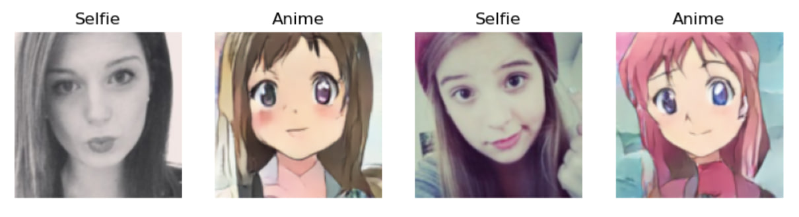
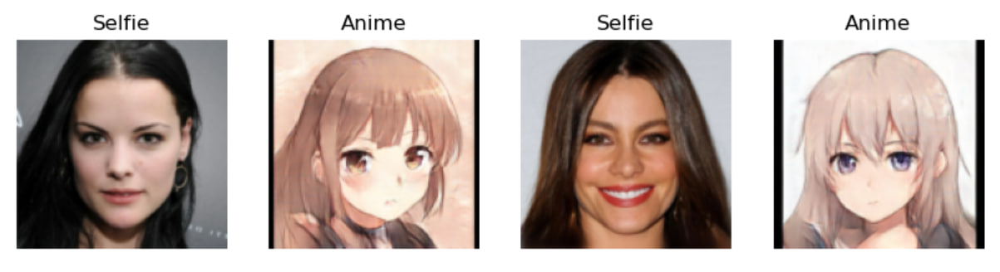
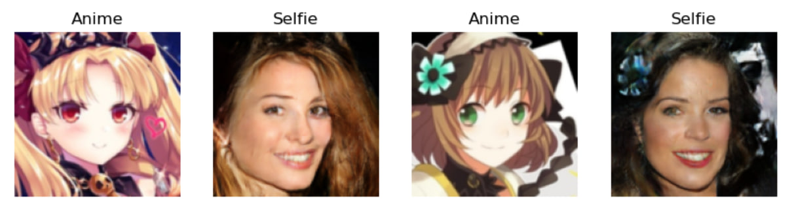

# Приветствую тебя на странице проекта по созданию и обучению Анибота!

## Общая информация

Данный проект состоит из двух частей:
- Обучение архитектуры CycleGAN на различных датасетах с разными параметрами;
- Создание Анибота - телеграм-бота, который способен преобразовывать женские фотографии в аниме-девушек и наоборот.

Но обо всём по порядку.

## CycleGAN

В данном проекте реализована классическая версия архитектуры CycleGAN, обученная с нуля. Из дополнительных
особенностей можно выделить использование шума при обучении дискриминатора и шедулера для корректировки
шага обучения.

При обучении моделей (поскольку в Аниботе используются веса различных CycleGAN`ов, каждые для своей задачи)
использовались различные датасеты и их комбинации, вот некоторые из них:
- [Сгенерированный нейросетью датасет с аниме изображениями](https://www.kaggle.com/datasets/prasoonkottarathil/gananime-lite/code);
- [Another anime face datatset с Kaggle](https://www.kaggle.com/datasets/scribbless/another-anime-face-dataset)
- [Датасет из статьи про AniGAN](https://arxiv.org/pdf/2102.12593.pdf);
- [Датасет "Selfie2Anime"](https://www.kaggle.com/datasets/arnaud58/selfie2anime)

и другие. Модели обучались как на отдельных датасетах, так и на комбинации из нескольких. Некоторые датасеты собирались с нуля
из разных частей. Однако, большая часть используемых датасетов ориентирована на женских аниме-персонажей из-за чего все модели
ориентированы на женские фотографии и аниме-изобажения. Также из-за специфики датасетов (определённого расположения ключевых
точек лица (глаза, губы, нос), для получения неплохих результатов необходимы фотографии и изображения, максимально приближенные
к тренировочной или тестовой выборкам.

Благодаря сохранению весов для каждой эпохи обучения удалось испробовать множество вариантов не сильно теряя в качестве. Модели
обучались от 100 до 300 эпох. После чего, обучение продолжалось с загрузки весов в модель и корректировки параметров.

Обучение CycleGAN производилось на локальном компьютере с использованием CUDA-ядер. Среднее время на обучения одной эпохи
с датасетом из 7000 изображений размером 128x128 пикселей занимает около 4 минут.

Результаты обучения одной из моделей можно посмотреть по следующей ссылке:
- [Пример обучения на датасете из статьи про AniGAN - 200 эпох](https://colab.research.google.com/drive/1xapVld8P8MIKtYCVxiAsoHEDPeME3Di0?hl=ru#scrollTo=76cf603c)

Чтобы запустить обучение CycleGAN, при условии, что у вас установлены необходимые библиотеки, достаточно скачать файл по ссылке выше или файл cyclegan.ipynb,
который находится в данном репозитории в папке services -> train.

## Телеграм-бот

### Возможности Анибота:
- преобразование фотографий в аниме:

<kbd></kbd>
Данный режим позволяет преобразывать селфи в аниме девушек, стараясь сохранить ключевые черты. 
- преобразование фотографий в милое аниме:
  
<kbd></kbd>
Данный режим позволяет преобразовывать фотографии в милых аниме-девушек, однако, поскольку обучение
производилось на сгенерированном датасете, данный режим почти не улавливает ключевые черты человека
на фотографии и скорее именно генерирует изображение, нежели трасформирует полученое. Однако, благодаря тому,
что в данном датасете используется один и тот же стиль изображений, качество таких изображений выше,
чем в предыдущем пункте.
- преобразование аниме в фотографии:

<kbd></kbd>
Данный режим позволяет преобразовывать аниме-девушкек в фотографии. Однако, здесь крайне важно позиционирование.
Чтобы получить неплохой результат, нужно очень точно расположить ключевые точки лица (глаза, рот, нос) на отправляемом
изображении (как можно ближе о обучающему и тренировочному датасетам). Иначе, вместо ожилдаемого результата можно
получить зарисовки к фильмам ужасов)

- Кстати о примерах. Бот позволяет перейти в одну из подготовленных папок в Яндекс Диске, чтобы скачать подходящие
фотографии и изобажения. Или просто ознакомиться с тем, какие изображения лучше всего использовать для каждого стиля.

### Основные команды:
- /start - вызов базового меню;
- /help - знакомство с Аниботом и его возможностями;
- /download - возможность ознакомиться и скачать фотографии и изображения;
- /github - возвожность быстро оказаться на данной странице и ознакомиться с кодом;

### Ключевые моменты:
- Анибот не хранит Ваши фотографии, а сразу же после преобразования очищает соответствующие директории;
- Как таковой базы данных на данный момент не реализовано. Когда новый пользователь впервые отправляет фотографию
боту, создаются две папки (одна для входящих изображений, другая для исходящих) с id пользователя, таким образом
Анибот не путается, кому какие изображения требуется отправить.

### Как пользоваться ботом:
- При активации Анибота, Вам будет предложено ознакомиться с Инструкцией, которую можно будет вызвать при помощи
команды /help;
- Либо сразу начать отправлять изображения. При получении изобажения, Анибот спросит Вас о желаем преобразовании
и начнёт твоить свою магию!)

### Что требуется для запуска своего бота:
- скачать данный репозиторий;
- проверить наличие требуемых библиотек;
- создать собственного бота в Телеграм и получить его токен;
- создать файл .env в директории с файлом bot.py и заполнить его согласно файлу .env.example;
- запустить файл bot.py;
- желание проделать данные шаги)
  
В Телеграме его можно будет найти по ссылке [https://t.me/FokzFirstBestBot](https://t.me/FokzFirstBestBot).

## Структура проекта:

📁 config
- bot_config.py - конфигуратор для запуска бота;
- model_config.py - константы и пути для модели и бота;

📁 git_examples - изображения для GitHub;

📁 handlers
- other_handlers.py - хэндлеры, реагирующие на на все остальные команды;
- user_handlers.py - хэндлеры, реагирующие на команды пользователей;

📁 keyboards
- keyboards.py - реализации клавиатуры;
- main_menu.py - реализация Menu бота;

📁 lexicon
- lexicon_ru.py - словарь для сообщений и команд;

📁 photo_storage
- 📁 in - директория создания папок с id пользователей для хранения получаемых ботом изображений;
- 📁 out - директория создания папок с id пользователей для хранения отправляемых ботом изображений;

📁 services
- 📁 train
  - cyclegan.ipynb - файл с примером кода для обучения CycleGAN
  
- 📁 weights
  - 📁 to_anime - веса для реализации преобразования фотографии в аниме;
  - 📁 to_cute_anime - веса для реализации преобразования фотографии в милое аниме;
  - 📁 to_selfie - веса для реализации преобразования аниме в фотографию;
  
- blocks.py - вспомогательные блоки для создания моделей;
- cycle_gan.py - инициализация весов;
- functions.py - вспомогательные функции;
- models.py - реализация Дискриминатора и Генератора;
- photo_processing.py - преобразование фотографий;

📁 tests
- test_models.py - тесты для Дискриминатора и Генератора;
- .env.example - пример токена для доступа к телеграм-боту;
- .gitignore
- bot.py - файл для запуска бота.
- requirements.txt

